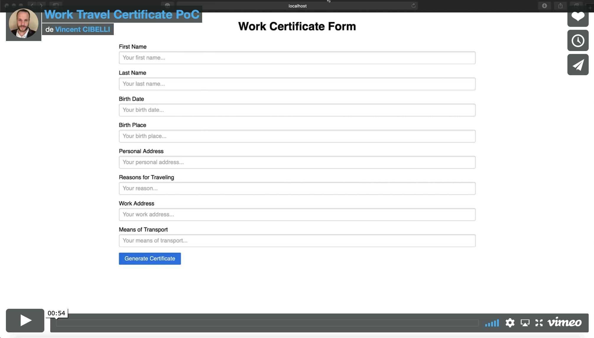

# Back To Work WebForm

[](https://vimeo.com/417140816/be0922ff0a)

## Description :
A very simple NodeJS application to generate work travel certificate (french certificate) during the COVID-19 pandemic. 

## Prerequisite :
* [PDFtk Server](https://www.pdflabs.com/tools/pdftk-server/) binary
* [NodeJS](https://nodejs.org/en/) binary

## Hot to use it :
1. Update static constants (statics.js file)
```javascript
module.exports = {
    validatorName: "[Validator Name]",
    validatorRole: "[Validator Role]",
    validity: "[Validity Period]",
    companyName: "[Company Name]",
    companyCity: "[Company City]"
}
```
2. Execute `npm run start` command (root path of the project) and open url [http://localhost:3000](http://localhost:3000) in your favorite browser.